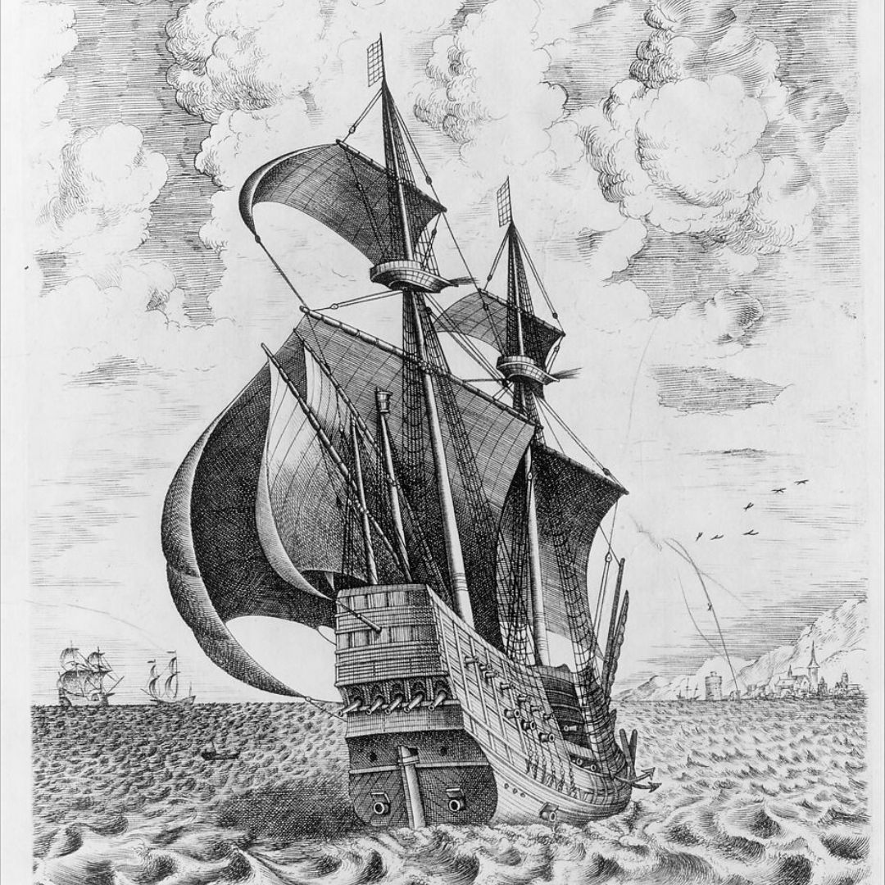
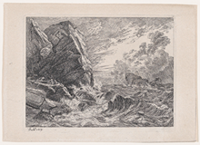

```js
2023 update
This post came out of a writing workshop back in 2021! Reading this nearly two years later is ironic as I did end up gaining proficiency in Python, using it at my day job and then just not really using it anymore... I've happily rekindled my interest here, this time with web design + dev.
```

Over the summer, I decided to learn a new skill. “I’ll learn python!”, I announced to colleagues far and near. I proceeded to tell everyone around me, converting my fear of humiliation to fuel as I sliced my calendar in halves to timebox daily sessions and quickly enrolled in a course that promised mastery.

## How it Began

> >  > > &nbsp;&nbsp;&nbsp;&nbsp;[Armed Four-Master Putting Out to Sea from The Sailing Vessels, Frans Huys, 1555-1556](https://www.metmuseum.org/art/collection/search/383047?deptids=9&ft=The+Sailing+Vessels+by+Frans+Huys&offset=0&rpp=40&pos=3)

#### Setting out to learn something outside of school is more challenging than you might think.

Teaching yourself a new skill is like a voyage. You’re most likely to succeed if you’re well-funded, with an abundance of resources and time. I imagined myself as a 15th century explorer journeying in the Age of Discovery. My goal was comparable as well. I didn’t realize it at the time, but I was laser-focused on reaching some destination, conquering new ground. Unlike Columbus or Magellan however, I’d play both voyager and sponsor in this mission. I first funded my expedition and then set sail.

#### The Compass

There’s this idea that I started to notice everywhere, from school to work and all the places in between that skipping ahead is useful, even rewarded. The kids that skipped grades were smarter and the colleagues that were fast-tracked promotions were exceptional. The folks that found their purpose and successes early in life made Forbes 30u30. These people are extraordinary, I agree and celebrate them. But somewhere along my celebration, I internalized this concept, and it became a guiding parameter. I wanted to be known as an ‘expert’ in Python before I had even begun. **When we start new things, do we simply obsess over the end-state?**

#### How it Went

I was off to a good start and sailing on smooth seas. Things were exciting as a ‘beginner’, charting new routes. The biggest challenge at this stage was the design of learning online, as a lone explorer. I was intrigued to try things I’d never been taught in a traditional setting. An Ali Abdaal [blog post](http://aliabdaal.com/studying/) encouraged me to practice spaced repetition and active recall methods for course exams. There was an almost infinite treasure trove of helpful tips across the web from other productivity Youtubers, [Python subreddits](http://www.reddit.com/r/learnpython/ "Python subreddits") and [Python discord groups](https://www.pythondiscord.com/).

I quickly progressed to the ‘intermediate’ course where I encountered my first storm at sea. I was burdened with the idea that I was no longer a beginner, and an endless flux of questions replaced the initial high. How long is this actually going to take? I was rushing the learning process, catching myself checking the duration of each video and skipping to 2x speed when possible.

Discovering Scott Young’s [Ultralearning blog](https://www.scotthyoung.com/blog/ultralearning/) provided inspiration in times of peril and still I remain in awe of his [12-month MIT Challenge](https://www.scotthyoung.com/blog/myprojects/mit-challenge-2/), where he completed a 4-year CS curriculum. My goal wasn’t nearly as ambitious – why the struggle? When I came across waves of real danger, I relied on [Can’t Hurt Me](https://www.goodreads.com/book/show/41721428-can-t-hurt-me) by David Goggins for a quick pep to power through. I read his tales from intense ultramarathons and his time with the US Navy SEALs while sitting behind my computer screen – again, why the struggle?

#### No Land in Sight

I somehow trudged along and made it to the first week of the ‘advanced’ course, but my voyage was getting farther off track. The storm grew into a destructive hurricane as I looked for ways to steer around my daily timeboxed sessions. Water started to flood a lower deck, and doubt started to fill in any empty crevice on board. I started to skip sessions altogether. There was nothing but mastery to look forward to on the horizon and yet, the closer I got to it, the farther it felt. Would I ever master this skill? How much longer? I was facing the ultimate question - “is this even worth it”?

I faltered and one week quickly became two, before I even considered revisiting any of my old work. I was losing progress by the day and needed a recourse, or all of my efforts would vanish.

#### Reorienting

With nothing but long, lonely days at sea I started to question my intent. Have we, as a society, over-indexed on the idea of “getting ahead”? Getting to the end-state, that next goal, some kind of final destination? It was at odds with most of the advice out there to “enjoy the present”, “live in the moment”.

I reached a verdict during one of my afternoon’s off, ignoring Python altogether. I was guilty of wanting to skip ahead. Instead of enjoying each moment of learning my chosen skill, I’d jumped to the conclusion that I’d never master it and forgotten why I even started in the first place. Why had I become so obsessed with mastery? I was flying through courses to print out a certificate. I went down a rabbit hole of what certificates even meant and who really cared anyway? Shouldn’t I be learning for a specific purpose?

> A smooth sea never made a skilled sailor

&nbsp;&nbsp;-Franklin D. Roosevelt

> > 

&nbsp;&nbsp;&nbsp;[The Shipwreck on a Rocky Shore, Johan Christian Dahl, 1819](https://www.metmuseum.org/art/collection/search/393392)

#### Finding Zen

I remembered how much I enjoyed the **beginner phase**. If I had just remained in beginner mode and let go of the myopic goal of mastery, I’d probably encounter greater success and happiness along the way.

Turns out, the true discovery on this expedition was stumbling upon the Zen Buddhist concept “shoshin” or “beginner’s mind”. Through one of my many Google searches for self-help, I found an entire school of thought dedicated to this life-changing idea.

Shunryu Suzuki’s [Zen Mind Beginner’s Mind](https://www.goodreads.com/en/book/show/402843) explains this perfectly,

> When we have no thought of achievement, no thought of self, we are true beginners. Then we can really learn something. The beginner’s mind is the mind of compassion… This is also the real secret of the arts: _always be a beginner_.

This simple idea has transformed my approach to every aspect of life from relationships to anxiety. I only wish I found this sooner, preferably before my journey to sea! Be a beginner, always.

Through introspection, I re-discovered **joy in the process** of learning and was able to recapture delight right from my desk. The act of exploration is the destination itself, not obsessing over finding some lost continent.
